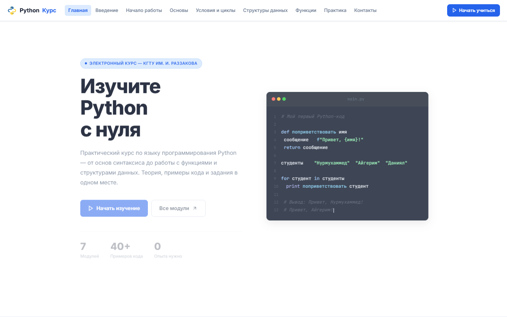
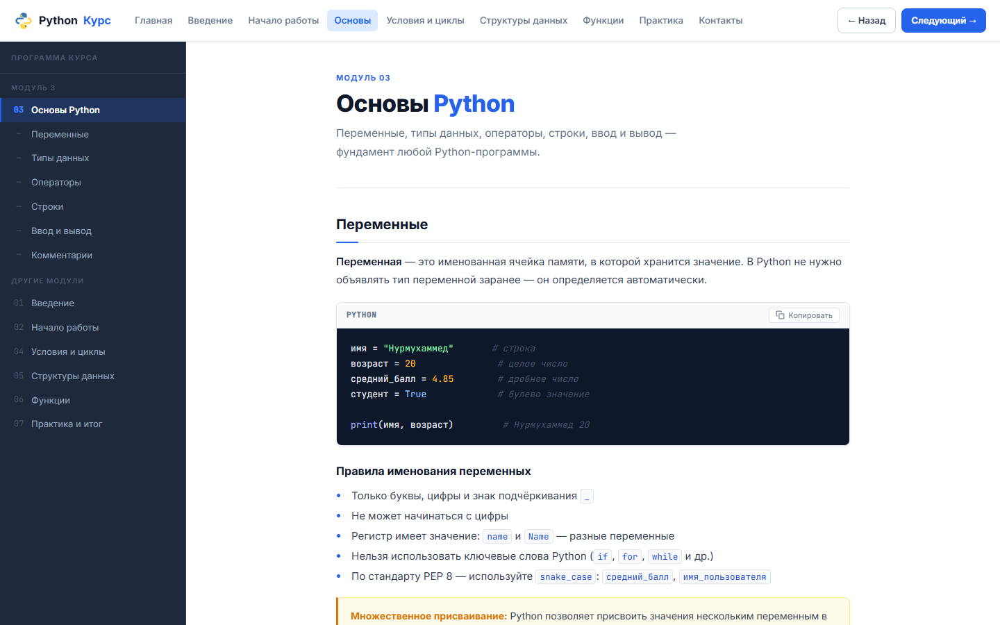
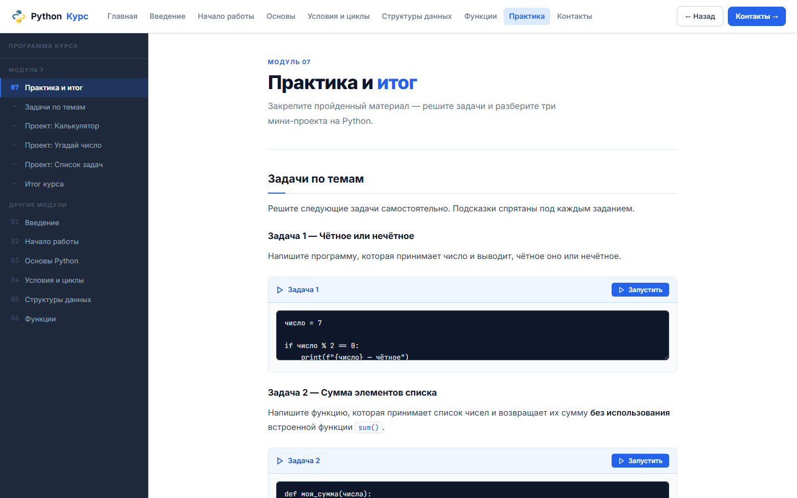
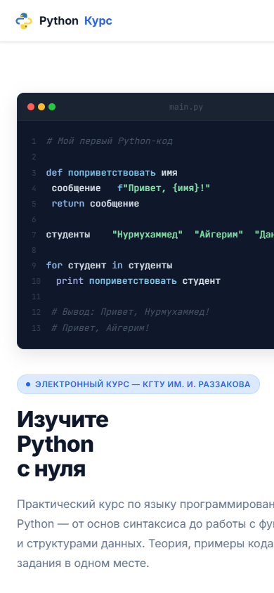

<div align="center">

# 🐍 Электронный курс «Язык программирования Python»

[](https://amanch1ik.github.io/Python-course-web-site/)
[](https://developer.mozilla.org/ru/docs/Web/HTML)
[](https://developer.mozilla.org/ru/docs/Web/CSS)
[](https://developer.mozilla.org/ru/docs/Web/JavaScript)
[](LICENSE)

Интерактивный образовательный веб-сайт по Python для студентов направления «Бизнес-информатика».  
Работает прямо в браузере — без установки, без сервера, без регистрации.

**Выпускная квалификационная работа**  
Абдубапов Нурмухаммед Адилетович · группа БИ 3-22  
КГТУ им. И. Раззакова · кафедра «Прикладная математика и информатика» · 2026

</div>

---

## 📸 Скриншоты

| Главная страница | Учебный модуль |
|:---:|:---:|
|  |  |

| Практика и проекты | Мобильный вид |
|:---:|:---:|
|  |  |

---

## ✨ Возможности

| Функция | Описание |
|---------|----------|
| 📚 **7 учебных модулей** | От установки Python до написания полноценных программ |
| 🎨 **Подсветка синтаксиса** | Цветовая разметка кода Python по категориям токенов |
| 📋 **Копирование кода** | Кнопка «Копировать» у каждого блока кода |
| ▶️ **«Попробуй сам»** | Интерактивные блоки для написания и запуска кода |
| 📱 **Адаптивный дизайн** | Корректно работает на смартфонах, планшетах и ПК |
| ✨ **Анимации** | Плавное появление элементов при прокрутке |
| 🗂️ **Навигация** | Боковая панель + мобильное меню + кнопки ← → |
| ⚡ **Без сервера** | Статический сайт, работает полностью офлайн |

---

## 📖 Структура курса

| № | Модуль | Основные темы | Время |
|---|--------|---------------|-------|
| 1 | 🚀 Введение в Python | История, области применения, REPL | ~20 мин |
| 2 | 🛠️ Начало работы | Установка, IDE, первая программа | ~20 мин |
| 3 | 📝 Основы Python | Переменные, типы данных, операторы, строки | ~40 мин |
| 4 | 🔀 Условия и циклы | if/elif/else, for, while, break, continue | ~35 мин |
| 5 | 📦 Структуры данных | list, tuple, dict, set | ~35 мин |
| 6 | ⚙️ Функции | def, параметры, return, lambda | ~30 мин |
| 7 | 🏆 Практика и итог | Калькулятор, игра «Угадай число», менеджер задач | ~90 мин |

**Полный курс:** ~5–6 часов при линейном прохождении.

---

## 🚀 Быстрый старт

### Способ 1 — Открыть в браузере (проще всего)

1. Нажми **Code → Download ZIP** на этой странице
2. Распакуй архив в любую папку
3. Открой файл `index.html` двойным кликом

> Работает в Chrome, Firefox, Edge, Safari без установки чего-либо.

### Способ 2 — Клонировать репозиторий

```bash
git clone https://github.com/Amanch1ik/Python-course-web-site.git
cd Python-course-web-site
# Открой index.html в браузере
```

### Способ 3 — Live Server (VS Code)

```
1. Установи VS Code + расширение Live Server
2. Открой папку проекта в VS Code
3. ПКМ на index.html → Open with Live Server
```

### Способ 4 — Python HTTP-сервер

```bash
python -m http.server 8000
# Открой http://localhost:8000
```

---

## 🗂️ Структура файлов

```
python-course/
├── index.html          ← Главная страница
├── vvedenie.html       ← Модуль 1: Введение в Python
├── nachalo.html        ← Модуль 2: Начало работы
├── osnovy.html         ← Модуль 3: Основы Python
├── usloviya.html       ← Модуль 4: Условия и циклы
├── struktury.html      ← Модуль 5: Структуры данных
├── funkcii.html        ← Модуль 6: Функции
├── praktika.html       ← Модуль 7: Практика и итог
├── kontakty.html       ← Контакты
├── css/
│   └── style.css       ← Все стили (~2500 строк)
├── js/
│   └── main.js         ← Интерактивность (~200 строк)
└── screenshots/        ← Скриншоты для README
```

---

## 🛠️ Технологии

- **HTML5** — семантическая разметка контента
- **CSS3** — стили, Flexbox, CSS-переменные, адаптивность, анимации
- **JavaScript (ES2022)** — навигация, AOS, копирование кода, симуляция Python
- **Google Fonts** — Inter (текст) + JetBrains Mono (код)
- **GitHub Pages** — бесплатный хостинг

---

## 📊 Результаты апробации

Курс прошёл педагогическую апробацию среди студентов кафедры ПМиИ КГТУ.

| Критерий | Оценка |
|----------|--------|
| Понятность изложения | ⭐⭐⭐⭐⭐ 4.7 / 5 |
| Удобство навигации | ⭐⭐⭐⭐⭐ 4.8 / 5 |
| Качество оформления | ⭐⭐⭐⭐⭐ 4.6 / 5 |
| Практическая полезность | ⭐⭐⭐⭐⭐ 4.9 / 5 |
| **Общая оценка** | **⭐⭐⭐⭐⭐ 4.7 / 5** |

95% участников порекомендовали бы курс однокурсникам.

---

## 👤 Автор

**Абдубапов Нурмухаммед Адилетович**  
Студент группы БИ 3-22  
КГТУ им. И. Раззакова, Бишкек · 2026

**Научный руководитель:** Кыштобаева Гульбара Кадыровна  
ст. преподаватель кафедры «Прикладная математика и информатика»

---

## 📄 Лицензия

Проект разработан в учебных целях. Свободно используйте для образования.
